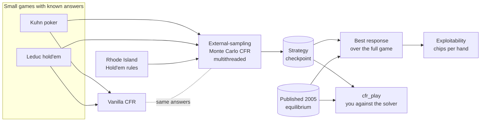
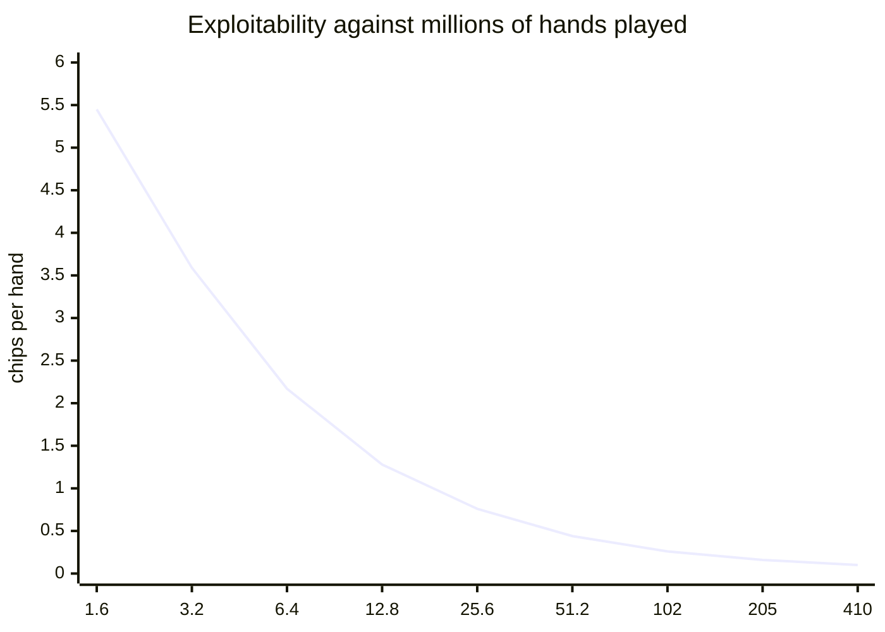

# Showdown: a Rhode Island Hold'em solver

A C++20 solver for Rhode Island Hold'em. It computes a
near-equilibrium strategy with Monte Carlo counterfactual regret
minimisation, measures how far that strategy is from equilibrium,
and includes a terminal program for playing against it.

Rhode Island Hold'em is a two-player poker game. Each player gets
one private card. Two public cards are dealt one at a time, with a
betting round before each and one after, and the best three-card
hand wins. The ante is 5 chips, the bet sizes are 10, 20 and 20
across the three rounds, and each round allows up to three bets.
The game has 5,139,368 information sets (distinct decision points).

Gilpin and Sandholm at Carnegie Mellon solved the game in 2005 and
published their strategy. This project uses that strategy as an
external check on its own measurement code.

## How it fits together



The solver uses counterfactual regret minimisation (CFR). At every
decision it tracks the regret of each action: how much more that
action would have won than the current strategy did. Each iteration
plays actions in proportion to their accumulated positive regret.
The average strategy over all iterations converges to a Nash
equilibrium.

The project has three parts:

- **The solver** samples the cards and the opponent's actions, and
  walks every action for the player being trained. Worker threads
  share one regret table through atomics, with no locks.
- **The best response** takes a strategy and computes the most an
  opponent who knows that strategy can win against it. The result
  is the *exploitability*, in chips per hand. An exact equilibrium
  has exploitability 0.
- **The demo** (`cfr_play`) deals hands at the terminal and plays a
  solved strategy against you.

## Results

Training run: 409.6 million hands, 8 threads, seed 1.



| hands played | exploitability (chips per hand) |
|---:|---:|
| 1,600,000 | 5.45 |
| 25,600,000 | 0.76 |
| 102,400,000 | 0.26 |
| 409,600,000 | **0.10** |

The final strategy has an exploitability of **0.10 chips per
hand**. The ante is 5 chips.

Source of the numbers: the curve is the log written by
`cfr_measure --train 409600000 runs/rih_409M.bin runs/rih_409M.log 1 8`
on 2026-08-02. The final value was re-measured from the saved
checkpoint with `cfr_measure runs/rih_409M.bin` on 2026-09-20.

Measured with the same best-response code:

| strategy | exploitability |
|---|---:|
| this solver, 409.6M hands | 0.10 |
| published 2005 equilibrium, as decoded here | TBD |

## How the measurement is checked

The exploitability code belongs to this project, so the tests pin
it to external facts:

- Kuhn poker has an exact game value of −1/18 per hand. Both
  solvers are tested to reach it.
- The two solvers are different algorithms. They are tested to
  agree on Leduc hold'em.
- The three-card hand evaluator is tested against a direct
  reference implementation over all 22,100 possible hands.
- The game is zero-sum. The full-game walk is tested to give the
  two players values that sum to zero.
- In the first betting round, the published equilibrium is tested
  to be a best response to itself. An error in the rules, the card
  mapping or the walk would fail this test.

## Build and run

Needs CMake 3.20+ and a C++20 compiler. Catch2 is fetched by CMake;
there are no other dependencies.

```sh
make build      # release build into .build/release
make test       # build, then run the test suite
make test-gcc   # same suite under gcc in Docker, matching CI
```

Train a strategy, measuring at every doubling:

```sh
.build/release/cfr_measure --train 102400000 \
    runs/strategy.bin runs/strategy.log 1 8
```

The arguments are hands to play, checkpoint path, log path, random
seed and thread count. Measure a saved checkpoint:

```sh
.build/release/cfr_measure runs/strategy.bin
```

Play against it:

```sh
.build/release/cfr_play runs/strategy.bin
```

With no argument, `cfr_play` plays the published 2005 equilibrium
instead. Those files are not in this repository; fetch them with:

```sh
curl -O http://www.cs.cmu.edu/~gilpin/GSI.jar
unzip -j GSI.jar 'strategy/*' -d data/gsi
```

## Layout

| path | what is in it |
|---|---|
| `src/game/` | rules for Kuhn, Leduc and Rhode Island Hold'em |
| `src/eval/` | three-card hand evaluator |
| `src/solver/` | both CFR solvers and both best responses |
| `src/grader/` | reader for the published equilibrium files |
| `src/measure/` | `cfr_measure`: train and score a strategy |
| `src/demo/` | `cfr_play`: play against a strategy |
| `tests/` | Catch2 suite and the reference hand evaluator |

## References

- Gilpin and Sandholm, "Optimal Rhode Island Hold'em Poker",
  AAAI 2005.
- Gilpin and Sandholm, "Lossless abstraction of imperfect
  information games", Journal of the ACM, 2007.
- Zinkevich, Johanson, Bowling and Piccione, "Regret Minimization
  in Games with Incomplete Information", NeurIPS 2007.
- Lanctot, Waugh, Zinkevich and Bowling, "Monte Carlo Sampling for
  Regret Minimization in Extensive Games", NeurIPS 2009.
